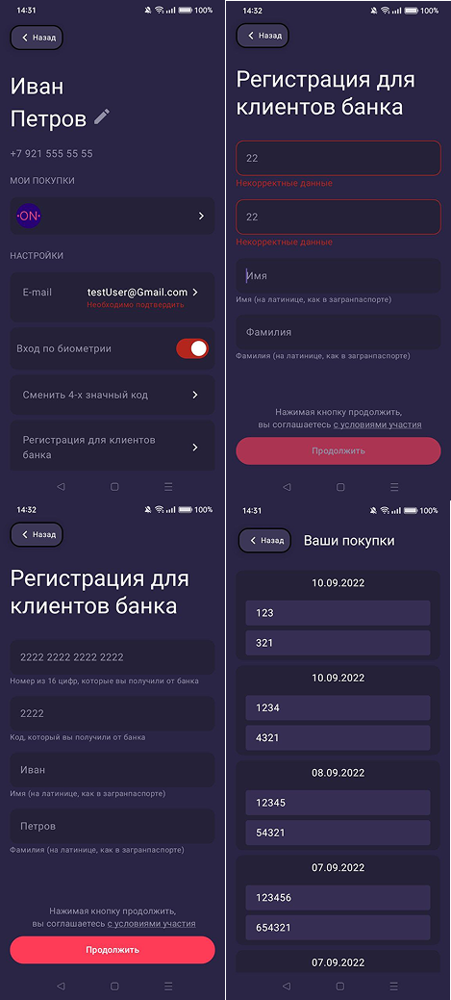

# Neurone Test App

Это тестовое задание на должность Android-разработчик для компании Neurone  

## Технологии
Язык: Kotlin  
UI: Jetpack Compose  
Навигация: Android navigation component(safe args)  
Архитектура: MVVM + MVI  
Асинхронные операции: Coroutines, Flow  
## Скриншоты  

